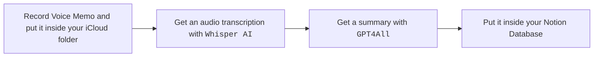

# voice_memos

Simple script takes a Voice Memo from iCloud, transcribes it with Whisper AI, summorize it with GPT4All and put it inside your Notion Database as a new page.

## Install

- [Duplicate the Notion template](https://artyomalekseev.notion.site/aebfff89f28c4320a94226df2b569447?v=2fa70c9b8d3f44b4a0b89003f32d9d5c&pvs=4)
- [Whisper AI to transcribe your notes](https://duckduckgo.com)
- [GPT4All](https://github.com/nomic-ai/gpt4all) + [Python bindings to summorize your transcriptions](https://github.com/nomic-ai/gpt4all/blob/main/gpt4all-bindings/python/README.md)
- <code>jq</code> (if not already in your system)
  
## Configuring

1) Prepare your Notion Database, it should have following fields: `date_recorded` and `duration`. Make sure that you added your application to the connenctions of the database.
2) Change variables inside the script: your iCloud folder with memos, Notion secret, Notion database to save transcriptions.
3) Change language, sound file format, and/or model size, GPT4All prompt, if needed.
4) Run it on with <code>bash script.sh &</code> to keep it on background.
5) Enjoy you freshly baked transcriptions inside your Notion database.

## Using

1) Record your amazing speech with Voice Memos
2) Move the recording to your selected iCloud folder
3) Run <code>bash script.sh</code>
4) Watch your note in Notion!

